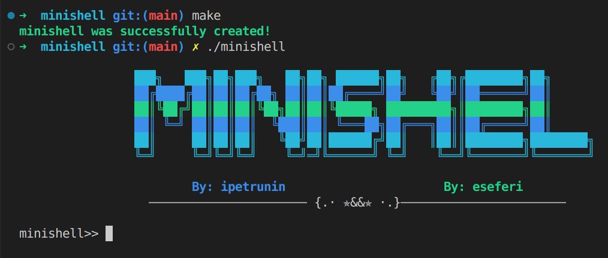
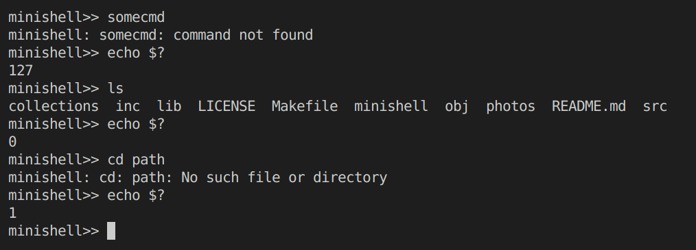
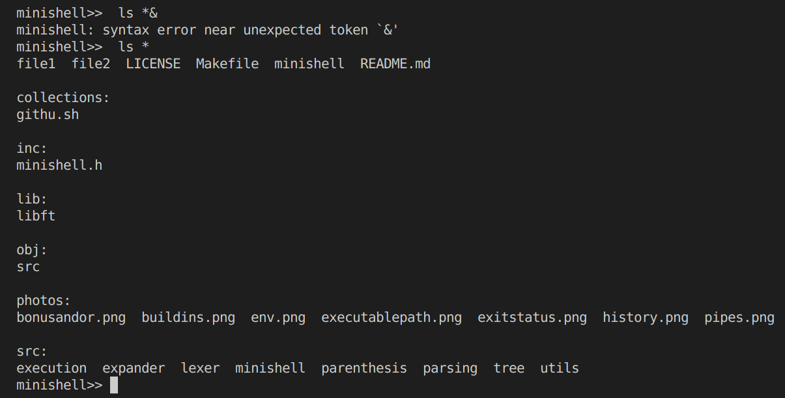

# Minishell
This project is about creating a simple shell. Yes, my own little bash. Here I learned a lot about processes and file descriptors.

## Table of Contents

- [Introduction](#introduction)
- [Features](#features)
- [How it Works](#how-it-works)
- [Installation](#installation)
- [Contributing](#contributing)
- [License](#license)

## Introduction

Minishell is a simple shell implementation in C. It's a minimal, basic shell that includes a subset of features from more complex shells like bash. This project is a great way to learn more about processes and file descriptors.

## Features

### Mandatory Part

1. Displays a prompt for user input.

2. Handles command history.

3. Searches and launches the right executable (based on the PATH variable or using relative or absolute paths).

4. Handles single ('') and double ("") quotes. (Not unclosed ones)

5. Implements redirections (<, >, <<, >>).

6. Implements pipes (|).

7. Handles environment variables ($VARNAME).

- Handles $? for exit status of the most recently executed foreground pipeline.

- Handles signals like ctrl-C, ctrl-D and ctrl-\.

- Includes built-in commands: echo with flags -n and without any flags cd, pwd, export, unset, env, exit.

### Bonus Part

- Handles && and || with parenthesis for priorities.

- Wildcards * should work for the current working directory

For more check the [subject](subject.pdf)

## How it Works

The Minishell program works in several stages:

1. **Lexical Analysis**: The input command line is first broken down into a list of tokens. Tokens can be simple words, operators, pipes, or redirections (input or output).

2. **Syntax Checking**: The list of tokens is checked for syntax errors. If any are found, an error message is displayed and the command line is not executed.

3. **Building the Command Tree**: A tree structure is built from the list of tokens. The root nodes of the tree are the `&&` and `||` operators, as they have the highest priority. The next level of the tree contains the pipe (`|`) operators. On the left and right of each pipe operator, there are command nodes. Each command node can have redirections (`<` and `>`) on its left and right.

4. **Execution**: The command tree is traversed and each command is executed in the order determined by the tree structure. Redirections are handled by redirecting the standard input or output of the command to the specified file.

This process allows Minishell to handle complex command lines with multiple commands, operators, and redirections, similar to a full-featured shell like bash.

## Installation

- Clone Repository by cloning also in recursive the submodule since im using my libft archive

   git clone https://github.com/vanichx/minishell.git minishell

- In case your readline has problems especially if you are on macs of 42 navigate to the collections directory and run the bash script

    ./githu.sh

- Navigate to the minishell folder and run
    
    make

- Type ./minishell and start playing with this minibash

## Contributing

This project was part of my coursework at school and was developed in collaboration with my partner, Ivan Petrunin. We also received invaluable help from our peers, creating a vibrant, on-site community similar to Stack Overflow. While the project was primarily for educational purposes, if you find any bugs or areas for improvement, feel free to open an issue or submit a pull request.

## License

Minishell is open source and available under the [MIT License](LICENSE). This means you can use, copy, modify, merge, publish, distribute, sublicense, and/or sell copies of the software, under the conditions stated in the license.
